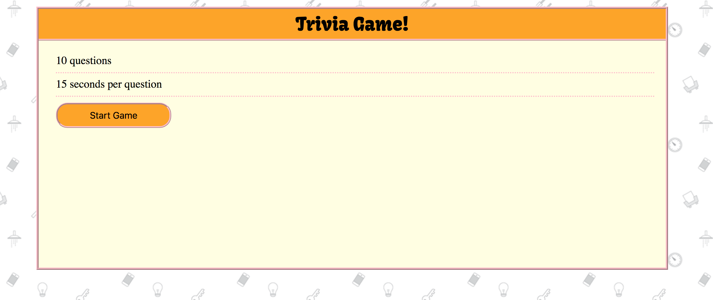

# TriviaGame

 
  This project was used to learn more JavaScripts fundamentals including: timer methods, manipulating the DOM and data structures.

 This project also allowed for greater development of CSS skills 

